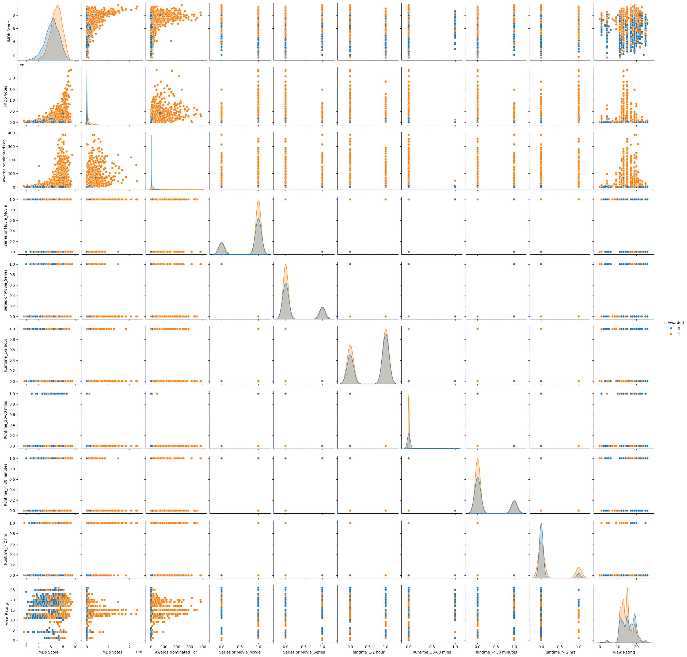
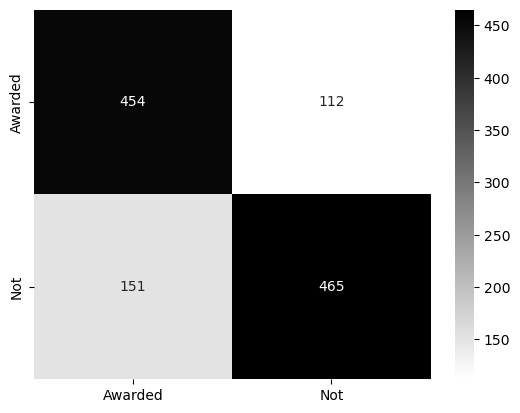
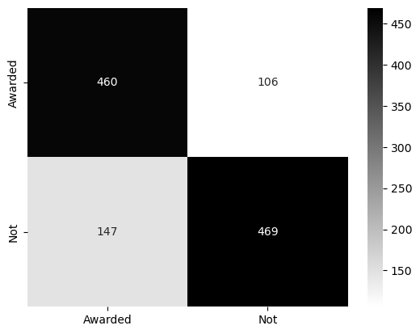
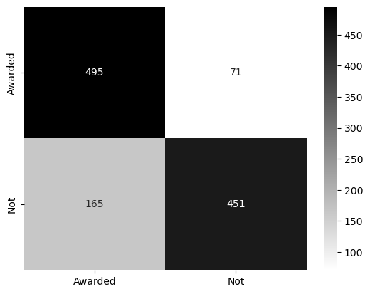
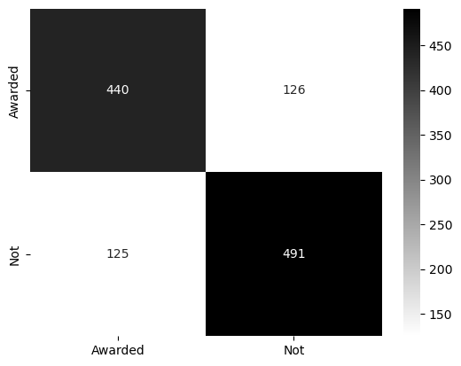
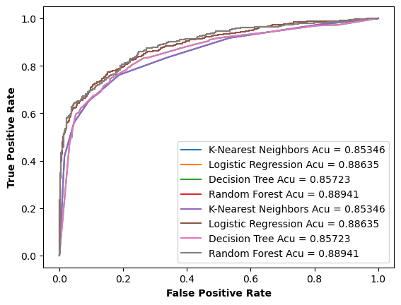

Import Libraries:


```python
 # Then import all the other libraries
import pandas as pd
import numpy as np
import seaborn as sns
import matplotlib.pyplot as plt
from sklearn.model_selection import train_test_split, GridSearchCV
from sklearn.metrics import classification_report, roc_auc_score, recall_score, roc_curve, precision_score, accuracy_score, f1_score, confusion_matrix
from sklearn.linear_model import LogisticRegression
from sklearn.preprocessing import LabelEncoder, StandardScaler
from sklearn.neighbors import KNeighborsClassifier
from sklearn.tree import DecisionTreeClassifier
from sklearn.feature_selection import RFE
from sklearn.ensemble import RandomForestClassifier
from sklearn.model_selection import RandomizedSearchCV
from pprint import pprint 

%matplotlib inline

import warnings
warnings.filterwarnings("ignore")
```


```python
data = pd.read_csv("Downloads/archive/netflix-rotten-tomatoes-metacritic-imdb.csv") 
```

Exploring the data 


```python
data.info()   
```

    <class 'pandas.core.frame.DataFrame'>
    RangeIndex: 15480 entries, 0 to 15479
    Data columns (total 29 columns):
     #   Column                 Non-Null Count  Dtype  
    ---  ------                 --------------  -----  
     0   Title                  15480 non-null  object 
     1   Genre                  13770 non-null  object 
     2   Tags                   15413 non-null  object 
     3   Languages              13526 non-null  object 
     4   Series or Movie        15480 non-null  object 
     5   Hidden Gem Score       13379 non-null  float64
     6   Country Availability   15461 non-null  object 
     7   Runtime                15479 non-null  object 
     8   Director               10772 non-null  object 
     9   Writer                 11150 non-null  object 
     10  Actors                 13555 non-null  object 
     11  View Rating            8456 non-null   object 
     12  IMDb Score             13381 non-null  float64
     13  Rotten Tomatoes Score  6382 non-null   float64
     14  Metacritic Score       4336 non-null   float64
     15  Awards Received        6075 non-null   float64
     16  Awards Nominated For   7661 non-null   float64
     17  Boxoffice              4007 non-null   object 
     18  Release Date           13373 non-null  object 
     19  Netflix Release Date   15480 non-null  object 
     20  Production House       5149 non-null   object 
     21  Netflix Link           15480 non-null  object 
     22  IMDb Link              13177 non-null  object 
     23  Summary                15471 non-null  object 
     24  IMDb Votes             13379 non-null  float64
     25  Image                  15480 non-null  object 
     26  Poster                 11842 non-null  object 
     27  TMDb Trailer           7194 non-null   object 
     28  Trailer Site           7194 non-null   object 
    dtypes: float64(7), object(22)
    memory usage: 3.4+ MB
    


```python
data.describe()
```


<div>
<style scoped>
    .dataframe tbody tr th:only-of-type {
        vertical-align: middle;
    }

    .dataframe tbody tr th {
        vertical-align: top;
    }

    .dataframe thead th {
        text-align: right;
    }
</style>
<table border="1" class="dataframe">
  <thead>
    <tr style="text-align: right;">
      <th></th>
      <th>Hidden Gem Score</th>
      <th>IMDb Score</th>
      <th>Rotten Tomatoes Score</th>
      <th>Metacritic Score</th>
      <th>Awards Received</th>
      <th>Awards Nominated For</th>
      <th>IMDb Votes</th>
    </tr>
  </thead>
  <tbody>
    <tr>
      <th>count</th>
      <td>13379.000000</td>
      <td>13381.000000</td>
      <td>6382.000000</td>
      <td>4336.000000</td>
      <td>6075.000000</td>
      <td>7661.000000</td>
      <td>1.337900e+04</td>
    </tr>
    <tr>
      <th>mean</th>
      <td>5.937551</td>
      <td>6.496054</td>
      <td>59.523034</td>
      <td>56.813653</td>
      <td>8.764444</td>
      <td>13.983161</td>
      <td>4.272841e+04</td>
    </tr>
    <tr>
      <th>std</th>
      <td>2.250202</td>
      <td>1.146910</td>
      <td>26.999173</td>
      <td>17.582545</td>
      <td>18.311171</td>
      <td>29.821052</td>
      <td>1.257012e+05</td>
    </tr>
    <tr>
      <th>min</th>
      <td>0.600000</td>
      <td>1.000000</td>
      <td>0.000000</td>
      <td>5.000000</td>
      <td>1.000000</td>
      <td>1.000000</td>
      <td>5.000000e+00</td>
    </tr>
    <tr>
      <th>25%</th>
      <td>3.800000</td>
      <td>5.800000</td>
      <td>38.000000</td>
      <td>44.000000</td>
      <td>1.000000</td>
      <td>2.000000</td>
      <td>4.035000e+02</td>
    </tr>
    <tr>
      <th>50%</th>
      <td>6.800000</td>
      <td>6.600000</td>
      <td>64.000000</td>
      <td>57.000000</td>
      <td>3.000000</td>
      <td>5.000000</td>
      <td>2.322000e+03</td>
    </tr>
    <tr>
      <th>75%</th>
      <td>7.900000</td>
      <td>7.300000</td>
      <td>83.000000</td>
      <td>70.000000</td>
      <td>8.000000</td>
      <td>12.000000</td>
      <td>2.089050e+04</td>
    </tr>
    <tr>
      <th>max</th>
      <td>9.800000</td>
      <td>9.700000</td>
      <td>100.000000</td>
      <td>100.000000</td>
      <td>300.000000</td>
      <td>386.000000</td>
      <td>2.354197e+06</td>
    </tr>
  </tbody>
</table>
</div>


```python
data.isna().sum()
```


    Title                        0
    Genre                     1710
    Tags                        67
    Languages                 1954
    Series or Movie              0
    Hidden Gem Score          2101
    Country Availability        19
    Runtime                      1
    Director                  4708
    Writer                    4330
    Actors                    1925
    View Rating               7024
    IMDb Score                2099
    Rotten Tomatoes Score     9098
    Metacritic Score         11144
    Awards Received           9405
    Awards Nominated For      7819
    Boxoffice                11473
    Release Date              2107
    Netflix Release Date         0
    Production House         10331
    Netflix Link                 0
    IMDb Link                 2303
    Summary                      9
    IMDb Votes                2101
    Image                        0
    Poster                    3638
    TMDb Trailer              8286
    Trailer Site              8286
    dtype: int64


```python
data.head(5)
```


<div>
<style scoped>
    .dataframe tbody tr th:only-of-type {
        vertical-align: middle;
    }

    .dataframe tbody tr th {
        vertical-align: top;
    }

    .dataframe thead th {
        text-align: right;
    }
</style>
<table border="1" class="dataframe">
  <thead>
    <tr style="text-align: right;">
      <th></th>
      <th>Title</th>
      <th>Genre</th>
      <th>Tags</th>
      <th>Languages</th>
      <th>Series or Movie</th>
      <th>Hidden Gem Score</th>
      <th>Country Availability</th>
      <th>Runtime</th>
      <th>Director</th>
      <th>Writer</th>
      <th>...</th>
      <th>Netflix Release Date</th>
      <th>Production House</th>
      <th>Netflix Link</th>
      <th>IMDb Link</th>
      <th>Summary</th>
      <th>IMDb Votes</th>
      <th>Image</th>
      <th>Poster</th>
      <th>TMDb Trailer</th>
      <th>Trailer Site</th>
    </tr>
  </thead>
  <tbody>
    <tr>
      <th>0</th>
      <td>Lets Fight Ghost</td>
      <td>Crime, Drama, Fantasy, Horror, Romance</td>
      <td>Comedy Programmes,Romantic TV Comedies,Horror ...</td>
      <td>Swedish, Spanish</td>
      <td>Series</td>
      <td>4.3</td>
      <td>Thailand</td>
      <td>&lt; 30 minutes</td>
      <td>Tomas Alfredson</td>
      <td>John Ajvide Lindqvist</td>
      <td>...</td>
      <td>2021-03-04</td>
      <td>Canal+, Sandrew Metronome</td>
      <td>https://www.netflix.com/watch/81415947</td>
      <td>https://www.imdb.com/title/tt1139797</td>
      <td>A med student with a supernatural gift tries t...</td>
      <td>205926.0</td>
      <td>https://occ-0-4708-64.1.nflxso.net/dnm/api/v6/...</td>
      <td>https://m.media-amazon.com/images/M/MV5BOWM4NT...</td>
      <td>NaN</td>
      <td>NaN</td>
    </tr>
    <tr>
      <th>1</th>
      <td>HOW TO BUILD A GIRL</td>
      <td>Comedy</td>
      <td>Dramas,Comedies,Films Based on Books,British</td>
      <td>English</td>
      <td>Movie</td>
      <td>7.0</td>
      <td>Canada</td>
      <td>1-2 hour</td>
      <td>Coky Giedroyc</td>
      <td>Caitlin Moran</td>
      <td>...</td>
      <td>2021-03-04</td>
      <td>Film 4, Monumental Pictures, Lionsgate</td>
      <td>https://www.netflix.com/watch/81041267</td>
      <td>https://www.imdb.com/title/tt4193072</td>
      <td>When nerdy Johanna moves to London, things get...</td>
      <td>2838.0</td>
      <td>https://occ-0-1081-999.1.nflxso.net/dnm/api/v6...</td>
      <td>https://m.media-amazon.com/images/M/MV5BZGUyN2...</td>
      <td>https://www.youtube.com/watch?v=eIbcxPy4okQ</td>
      <td>YouTube</td>
    </tr>
    <tr>
      <th>2</th>
      <td>Centigrade</td>
      <td>Drama, Thriller</td>
      <td>Thrillers</td>
      <td>English</td>
      <td>Movie</td>
      <td>6.4</td>
      <td>Canada</td>
      <td>1-2 hour</td>
      <td>Brendan Walsh</td>
      <td>Brendan Walsh, Daley Nixon</td>
      <td>...</td>
      <td>2021-03-04</td>
      <td>NaN</td>
      <td>https://www.netflix.com/watch/81305978</td>
      <td>https://www.imdb.com/title/tt8945942</td>
      <td>Trapped in a frozen car during a blizzard, a p...</td>
      <td>1720.0</td>
      <td>https://occ-0-1081-999.1.nflxso.net/dnm/api/v6...</td>
      <td>https://m.media-amazon.com/images/M/MV5BODM2MD...</td>
      <td>https://www.youtube.com/watch?v=0RvV7TNUlkQ</td>
      <td>YouTube</td>
    </tr>
    <tr>
      <th>3</th>
      <td>ANNE+</td>
      <td>Drama</td>
      <td>TV Dramas,Romantic TV Dramas,Dutch TV Shows</td>
      <td>Turkish</td>
      <td>Series</td>
      <td>7.7</td>
      <td>Belgium,Netherlands</td>
      <td>&lt; 30 minutes</td>
      <td>NaN</td>
      <td>NaN</td>
      <td>...</td>
      <td>2021-03-04</td>
      <td>NaN</td>
      <td>https://www.netflix.com/watch/81336456</td>
      <td>https://www.imdb.com/title/tt6132758</td>
      <td>Upon moving into a new place, a 20-something r...</td>
      <td>1147.0</td>
      <td>https://occ-0-1489-1490.1.nflxso.net/dnm/api/v...</td>
      <td>https://m.media-amazon.com/images/M/MV5BNWRkMz...</td>
      <td>NaN</td>
      <td>NaN</td>
    </tr>
    <tr>
      <th>4</th>
      <td>Moxie</td>
      <td>Animation, Short, Drama</td>
      <td>Social Issue Dramas,Teen Movies,Dramas,Comedie...</td>
      <td>English</td>
      <td>Movie</td>
      <td>8.1</td>
      <td>Lithuania,Poland,France,Iceland,Italy,Spain,Gr...</td>
      <td>1-2 hour</td>
      <td>Stephen Irwin</td>
      <td>NaN</td>
      <td>...</td>
      <td>2021-03-04</td>
      <td>NaN</td>
      <td>https://www.netflix.com/watch/81078393</td>
      <td>https://www.imdb.com/title/tt2023611</td>
      <td>Inspired by her moms rebellious past and a con...</td>
      <td>63.0</td>
      <td>https://occ-0-4039-1500.1.nflxso.net/dnm/api/v...</td>
      <td>https://m.media-amazon.com/images/M/MV5BODYyNW...</td>
      <td>NaN</td>
      <td>NaN</td>
    </tr>
  </tbody>
</table>
<p>5 rows × 29 columns</p>
</div>


```python
# dropping unneeded columns
df = data.copy()
df.drop(columns=['Metacritic Score','Production House','Boxoffice','TMDb Trailer',
                 'Trailer Site','Netflix Link','IMDb Link','Image','Tags',
                 'Rotten Tomatoes Score','Poster','Director','Writer','Actors',
                'Release Date','Summary','Languages','Genre','Country Availability',
                'Hidden Gem Score','Netflix Release Date'],inplace=True)
```


```python
# filling none values with zero, as it means 0 awards
df['Awards Received'].fillna(0,inplace=True)
df['Awards Nominated For'].fillna(0,inplace=True)
```


```python
# creating new columns
df['Is Nominated'] = df['Awards Nominated For'].apply(lambda x: x != 0)
df['Is Nominated'] = df['Is Nominated'].astype(int)
df['Is Awarded'] = df['Awards Received'].apply(lambda x: x != 0)
df['Is Awarded'] = df['Is Awarded'].astype(int)
```


```python
# dropping the missing values from View Rating columns
df.dropna(axis=0,subset=['View Rating'],inplace=True)
```


```python
#df['View Rating'].fillna(df['View Rating'].mode()[0], inplace=True)
```


```python
df.isna().sum()
```


    Title                    0
    Series or Movie          0
    Runtime                  1
    View Rating              0
    IMDb Score              12
    Awards Received          0
    Awards Nominated For     0
    IMDb Votes              12
    Is Nominated             0
    Is Awarded               0
    dtype: int64


```python
# filling the missing values of IMDb Score & IMDb Votes
df['IMDb Score'].fillna(df['IMDb Score'].mean,inplace=True)
df['IMDb Votes'].fillna(df['IMDb Votes'].mean,inplace=True)

# dropping the nulls from Runtime
df.dropna(subset=['Runtime'],inplace=True)
```


```python
# checking the null values
df.isna().sum()
```


    Title                   0
    Series or Movie         0
    Runtime                 0
    View Rating             0
    IMDb Score              0
    Awards Received         0
    Awards Nominated For    0
    IMDb Votes              0
    Is Nominated            0
    Is Awarded              0
    dtype: int64


```python
# fixing the index to use it in the next step with IMDb Votes
df.index = pd.RangeIndex(start=1, stop=1+len(df), step=1)
```


```python
def get_index(column):
    ctr = 0
    lis = []
    for i,d in enumerate(df[column]) :
        if type(d) != float :
            lis.append(i+1)
            ctr+=1
    print(ctr)
    return lis
```


```python
ind = get_index('IMDb Votes')
```

    12
    


```python
print(ind)
```

    [108, 312, 666, 1104, 1117, 1167, 1290, 1981, 2311, 4473, 6374, 7574]
    


```python
# dropping the index which contains string values in IMDb Votes column
df.drop(ind,inplace=True)
df.index = pd.RangeIndex(start=1, stop=1+len(df), step=1)
```


```python
# fixing the data type of IMDb Votes & IMDb Score
df['IMDb Votes'] = df['IMDb Votes'].astype('int64')
df['IMDb Score'] = df['IMDb Score'].astype('float')
```


```python
# checking if the target data are balanced or not
df['Is Awarded'].value_counts()
```


    Is Awarded
    1    4556
    0    3887
    Name: count, dtype: int64


```python
df.to_csv('cleaned_netflix_data.csv')
```

Modeling


```python
df.info()
```

    <class 'pandas.core.frame.DataFrame'>
    RangeIndex: 8443 entries, 1 to 8443
    Data columns (total 10 columns):
     #   Column                Non-Null Count  Dtype  
    ---  ------                --------------  -----  
     0   Title                 8443 non-null   object 
     1   Series or Movie       8443 non-null   object 
     2   Runtime               8443 non-null   object 
     3   View Rating           8443 non-null   object 
     4   IMDb Score            8443 non-null   float64
     5   Awards Received       8443 non-null   float64
     6   Awards Nominated For  8443 non-null   float64
     7   IMDb Votes            8443 non-null   int64  
     8   Is Nominated          8443 non-null   int32  
     9   Is Awarded            8443 non-null   int32  
    dtypes: float64(3), int32(2), int64(1), object(4)
    memory usage: 593.8+ KB
    


```python
selected_fetures = df[['Series or Movie','Runtime','IMDb Score','IMDb Votes',
                       'Awards Nominated For']]
X = pd.get_dummies(selected_fetures, drop_first=False)
X = pd.concat([X,df['View Rating']],axis=1)
y = df.iloc[:,-1:]
```


```python
encoder = LabelEncoder()
encoded = encoder.fit_transform(X['View Rating'])
X['View Rating'] = encoded
```


```python
sns.pairplot(pd.concat([X,y],axis=1),hue='Is Awarded')
plt.show()
```


    

    


```python
# create a new dataframe to use it for the pair plot
netflix = pd.concat([X,y],axis=1)

```

Splitting the data


```python
X_train_val, X_test, y_train_val, y_test = train_test_split(X,y,test_size=0.3,random_state=42)
X_train_val, X_test, y_train_val, y_test = X_train_val.reset_index(drop=True),X_test.reset_index(drop=True),y_train_val.reset_index(drop=True),y_test.reset_index(drop=True)
```

Scaling


```python
to_scale = [col for col in X.columns if X[col].max()>1]

sc = StandardScaler()

scaled_train = sc.fit_transform(X_train_val[to_scale])
scaled_train = pd.DataFrame(scaled_train,columns=to_scale)

scaled_test = sc.fit_transform(X_test[to_scale])
scaled_test = pd.DataFrame(scaled_test,columns=to_scale)

#Replace the original columns with the scaled ones
for col in scaled_train:
    X_train_val[col] = scaled_train[col]
    X_test[col] = scaled_test[col]
```


```python
y_train_val['Is Awarded'].value_counts()
```


    Is Awarded
    1    3187
    0    2723
    Name: count, dtype: int64


```python
X_train, X_val, y_train, y_val = train_test_split(X_train_val, y_train_val, test_size=0.2,random_state=42)
```


```python
y_train['Is Awarded'].value_counts()
```


    Is Awarded
    1    2571
    0    2157
    Name: count, dtype: int64


Baseline Model: K-Nearest Neighbors


```python
# create a dict to store the scores of each model
models_dict = {'Model':[],
              'Accuracy':[],
              'Recall':[],
              'Precision':[],
              'F1 score':[],}
```


```python
#train the model and validate
knn = KNeighborsClassifier(n_neighbors=5)
knn.fit(X_train,y_train)
y_pred = knn.predict(X_val)

print("\nKNN Accuracy=",accuracy_score(y_val, y_pred))
print("KNN F1 score=",f1_score(y_val, y_pred))
```

    
    KNN Accuracy= 0.7774957698815567
    KNN F1 score= 0.779547359597653
    


```python
#test the baseline model
test_pred=knn.predict(X_test)
print("\nKNN Accuracy=",accuracy_score(y_test, test_pred))
print("KNN F1 score=",f1_score(y_test, test_pred))
```

    
    KNN Accuracy= 0.775759968416897
    KNN F1 score= 0.7798449612403101
    


```python
cm = confusion_matrix(y_val, y_pred)
class_label = ["Awarded", "Not"]
df_cm = pd.DataFrame(cm, index = class_label, columns = class_label)
sns.heatmap(df_cm, annot = True, fmt = "d", cmap=plt.cm.binary)
plt.show()
```


    

    


```python
# finding the best k
k_range = list(range(1,100))
param_grid = dict(n_neighbors=k_range)
gc = GridSearchCV(knn, param_grid, cv=10, scoring='f1')
gc.fit(X_train_val, y_train_val)
gc.best_params_
```


    {'n_neighbors': 7}


```python
best_knn = KNeighborsClassifier(n_neighbors=7)
best_knn.fit(X_train,y_train)
y_pred = best_knn.predict(X_val)

print("\nKNN Accuracy=",accuracy_score(y_val, y_pred))
print("KNN F1 score=",f1_score(y_val, y_pred))
```

    
    KNN Accuracy= 0.7859560067681896
    KNN F1 score= 0.7875734676742233
    


```python
y_pred_proba = best_knn.predict_proba(X_val)[::,1]
knn_fpr, knn_tpr, knn_threshold = roc_curve(y_val, y_pred_proba)
knn_roc_auc = roc_auc_score(y_val, y_pred_proba)

models_dict['Model'].append("KNN ")
models_dict['Accuracy'].append(accuracy_score(y_val, y_pred))
models_dict['Recall'].append(recall_score(y_val, y_pred))
models_dict['Precision'].append(precision_score(y_val, y_pred))
models_dict['F1 score'].append(f1_score(y_val, y_pred))
```


```python
cm = confusion_matrix(y_val, y_pred)
class_label = ["Awarded", "Not"]
df_cm = pd.DataFrame(cm, index = class_label, columns = class_label)
sns.heatmap(df_cm, annot = True, fmt = "d", cmap=plt.cm.binary)
plt.show()
```


    

    


Logistic Regression 


```python
lr = LogisticRegression()
lr.fit(X_train,y_train)
y_pred = lr.predict(X_val)

print("\nLogistic Regression Accuracy=",accuracy_score(y_val, y_pred))
print("Logistic Regression F1 score=",f1_score(y_val, y_pred))
```

    
    Logistic Regression Accuracy= 0.8003384094754653
    Logistic Regression F1 score= 0.7926186291739895
    


```python
y_pred_proba = lr.predict_proba(X_val)[::,1]
lr_fpr, lr_tpr, lr_threshold = roc_curve(y_val, y_pred_proba)
lr_roc_auc = roc_auc_score(y_val, y_pred_proba)

models_dict['Model'].append("Logistic Regression ")
models_dict['Accuracy'].append(accuracy_score(y_val, y_pred))
models_dict['Recall'].append(recall_score(y_val, y_pred))
models_dict['Precision'].append(precision_score(y_val, y_pred))
models_dict['F1 score'].append(f1_score(y_val, y_pred))
```


```python
cm = confusion_matrix(y_val, y_pred)
class_label = ["Awarded", "Not"]
df_cm = pd.DataFrame(cm, index = class_label, columns = class_label)
sns.heatmap(df_cm, annot = True, fmt = "d", cmap=plt.cm.binary)
plt.show()


```


    

    


Dicision Tree


```python
# finding the best parameters for the decision tree
param_grid = {'criterion' :['gini', 'entropy'],
              'max_depth' : list(range(5,20)),
             'max_features': ['auto', 'sqrt', 'log2']}

tree_clas = DecisionTreeClassifier(random_state=42)
grid_search = GridSearchCV(estimator=tree_clas, param_grid=param_grid,
                           cv=5, verbose=True, scoring = 'f1')
grid_search.fit(X_train_val, y_train_val)

print(grid_search.best_estimator_)

```

    Fitting 5 folds for each of 90 candidates, totalling 450 fits
    DecisionTreeClassifier(criterion='entropy', max_depth=8, max_features='sqrt',
                           random_state=42)
    


```python
# trying with entropy, since it didn't show in the previose step
tree = DecisionTreeClassifier(criterion='entropy',
                                     max_depth=8,
                                     max_features=None,
                                     random_state=42)

tree.fit(X_train,y_train)
y_pred = tree.predict(X_val)

print("DT Accuracy=",accuracy_score(y_val, y_pred))
print("DT F1 score=",f1_score(y_val, y_pred))
```

    DT Accuracy= 0.7876480541455161
    DT F1 score= 0.7964314679643146
    


```python
# stroring the best models in the dict
y_pred_proba = tree.predict_proba(X_val)[::,1]
dt_fpr, dt_tpr, dt_threshold = roc_curve(y_val, y_pred_proba)
dt_roc_auc = roc_auc_score(y_val, y_pred_proba)

models_dict['Model'].append("Decision Tree")
models_dict['Accuracy'].append(accuracy_score(y_val, y_pred))
models_dict['Recall'].append(recall_score(y_val, y_pred))
models_dict['Precision'].append(precision_score(y_val, y_pred))
models_dict['F1 score'].append(f1_score(y_val, y_pred))
```


```python
 #plotting confusion mtrix
cm = confusion_matrix(y_val, y_pred)
class_label = ["Awarded", "Not"]
df_cm = pd.DataFrame(cm, index = class_label, columns = class_label)
sns.heatmap(df_cm, annot = True, fmt = "d", cmap=plt.cm.binary)
plt.show()
```


    

    


 Random Forest


```python
# define random_grid for tuning
n_estimators = [int(x) for x in np.linspace(start = 200, stop = 2000, num = 10)]
max_features = ['auto', 'sqrt']
max_depth = [int(x) for x in np.linspace(10, 110, num = 11)]
max_depth.append(None)
min_samples_split = [2, 5, 10]
min_samples_leaf = [1, 2, 4]
bootstrap = [True, False]

random_grid = {'n_estimators': n_estimators,
               'max_features': max_features,
               'max_depth': max_depth,
               'min_samples_split': min_samples_split,
               'min_samples_leaf': min_samples_leaf,
               'bootstrap': bootstrap}

pprint(random_grid)
```

    {'bootstrap': [True, False],
     'max_depth': [10, 20, 30, 40, 50, 60, 70, 80, 90, 100, 110, None],
     'max_features': ['auto', 'sqrt'],
     'min_samples_leaf': [1, 2, 4],
     'min_samples_split': [2, 5, 10],
     'n_estimators': [200, 400, 600, 800, 1000, 1200, 1400, 1600, 1800, 2000]}
    


```python
# Random Forest Tuning
rf = RandomForestClassifier()
rf_random = RandomizedSearchCV(estimator = rf,
                               param_distributions = random_grid,
                               n_iter = 100, cv = 3, verbose=2,
                               random_state=42, n_jobs = -1)

rf_random.fit(X_train_val, y_train_val)
rf_random.best_params_
```

    Fitting 3 folds for each of 100 candidates, totalling 300 fits
    


    {'n_estimators': 400,
     'min_samples_split': 2,
     'min_samples_leaf': 4,
     'max_features': 'sqrt',
     'max_depth': 10,
     'bootstrap': True}


```python
# Random Forest with best hyperparameter
rf_best = RandomForestClassifier(n_estimators=1600,
                                 min_samples_split=2,
                                 min_samples_leaf=4,
                                 max_features='sqrt',
                                 max_depth=10,
                                 bootstrap=True)
rf_best.fit(X_train, y_train)
y_pred = rf_best.predict(X_val)


print("RF Accuracy=",accuracy_score(y_val, y_pred))
print("RF F1 score=",f1_score(y_val, y_pred))
```

    RF Accuracy= 0.8011844331641286
    RF F1 score= 0.8075348075348076
    


```python
# stroring the best models in the dict
y_pred_proba = rf_best.predict_proba(X_val)[::,1]
rf_fpr, rf_tpr, rf_threshold = roc_curve(y_val, y_pred_proba)
rf_roc_auc = roc_auc_score(y_val, y_pred_proba)

models_dict['Model'].append("Random Forest")
models_dict['Accuracy'].append(accuracy_score(y_val, y_pred))
models_dict['Recall'].append(recall_score(y_val, y_pred))
models_dict['Precision'].append(precision_score(y_val, y_pred))
models_dict['F1 score'].append(f1_score(y_val, y_pred))
```


```python
# plotting confusion mtrix
cm = confusion_matrix(y_val, y_pred)
class_label = ["Awarded", "Not"]
df_cm = pd.DataFrame(cm, index = class_label, columns = class_label)
sns.heatmap(df_cm, annot = True, fmt = "d", cmap=plt.cm.binary)
plt.show()
```


    

    


Ensembling with staking


```python

estimators = [
     ('rf', RandomForestClassifier(n_estimators=1600,
                                 min_samples_split=2,
                                 min_samples_leaf=4,
                                 max_features='sqrt',
                                 max_depth=10,
                                 bootstrap=True))
 ]
clf = StackingClassifier(
     estimators=estimators, final_estimator=LogisticRegression()
 )
from sklearn.model_selection import train_test_split
X_train, X_test, y_train, y_test = train_test_split(X, y, stratify=y, random_state=42)
X_train, X_val, y_train, y_val = train_test_split(X_train, y_train, test_size=0.2, random_state=42)  # Fixed variable names

clf.fit(X_train, y_train)
y_pred = clf.predict(X_val)

print("SC Accuracy=",accuracy_score(y_val, y_pred))
print("SC F1 score=",f1_score(y_val, y_pred))
```

    SC Accuracy= 0.7940015785319653
    SC F1 score= 0.8112798264642083
    


```python
models_dict['Model'].append("StackingClassifier")
models_dict['Accuracy'].append(accuracy_score(y_val, y_pred))
models_dict['Recall'].append(recall_score(y_val, y_pred))
models_dict['Precision'].append(precision_score(y_val, y_pred))
models_dict['F1 score'].append(f1_score(y_val, y_pred))
```

Evaluating


```python
# conver the dict into dataframe for visualizations
result = pd.DataFrame.from_dict(models_dict)
result

```


<div>
<style scoped>
    .dataframe tbody tr th:only-of-type {
        vertical-align: middle;
    }

    .dataframe tbody tr th {
        vertical-align: top;
    }

    .dataframe thead th {
        text-align: right;
    }
</style>
<table border="1" class="dataframe">
  <thead>
    <tr style="text-align: right;">
      <th></th>
      <th>Model</th>
      <th>Accuracy</th>
      <th>Recall</th>
      <th>Precision</th>
      <th>F1 score</th>
    </tr>
  </thead>
  <tbody>
    <tr>
      <th>0</th>
      <td>KNN</td>
      <td>0.785956</td>
      <td>0.761364</td>
      <td>0.815652</td>
      <td>0.787573</td>
    </tr>
    <tr>
      <th>1</th>
      <td>Logistic Regression</td>
      <td>0.800338</td>
      <td>0.732143</td>
      <td>0.863985</td>
      <td>0.792619</td>
    </tr>
    <tr>
      <th>2</th>
      <td>Decision Tree</td>
      <td>0.787648</td>
      <td>0.797078</td>
      <td>0.795786</td>
      <td>0.796431</td>
    </tr>
    <tr>
      <th>3</th>
      <td>StackingClassifier</td>
      <td>0.794002</td>
      <td>0.799145</td>
      <td>0.823789</td>
      <td>0.811280</td>
    </tr>
  </tbody>
</table>
</div>


```python
y_train_val
```


<div>
<style scoped>
    .dataframe tbody tr th:only-of-type {
        vertical-align: middle;
    }

    .dataframe tbody tr th {
        vertical-align: top;
    }

    .dataframe thead th {
        text-align: right;
    }
</style>
<table border="1" class="dataframe">
  <thead>
    <tr style="text-align: right;">
      <th></th>
      <th>Is Awarded</th>
    </tr>
  </thead>
  <tbody>
    <tr>
      <th>0</th>
      <td>1</td>
    </tr>
    <tr>
      <th>1</th>
      <td>0</td>
    </tr>
    <tr>
      <th>2</th>
      <td>1</td>
    </tr>
    <tr>
      <th>3</th>
      <td>0</td>
    </tr>
    <tr>
      <th>4</th>
      <td>1</td>
    </tr>
    <tr>
      <th>...</th>
      <td>...</td>
    </tr>
    <tr>
      <th>5905</th>
      <td>1</td>
    </tr>
    <tr>
      <th>5906</th>
      <td>1</td>
    </tr>
    <tr>
      <th>5907</th>
      <td>1</td>
    </tr>
    <tr>
      <th>5908</th>
      <td>0</td>
    </tr>
    <tr>
      <th>5909</th>
      <td>1</td>
    </tr>
  </tbody>
</table>
<p>5910 rows × 1 columns</p>
</div>


```python
# Random Forest with best hyperparameter
rf_best = RandomForestClassifier(n_estimators=1600,
                                 min_samples_split=2,
                                 min_samples_leaf=4,
                                 max_features='sqrt',
                                 max_depth=10,
                                 bootstrap=True)
rf_best.fit(X_train, y_train)
y_pred = rf_best.predict(X_test)


print("RF Accuracy=",accuracy_score(y_test, y_pred))
print("RF F1 score=",f1_score(y_test, y_pred))
```

    RF Accuracy= 0.8109900521080057
    RF F1 score= 0.8239964711071901
    


```python
# plotting the ROC curve
plt.plot(knn_fpr, knn_tpr, label='K-Nearest Neighbors Acu = {:0.5f}'.format(knn_roc_auc))
plt.plot(lr_fpr, lr_tpr, label='Logistic Regression Acu = {:0.5f}'.format(lr_roc_auc))
plt.plot(dt_fpr, dt_tpr, label='Decision Tree Acu = {:0.5f}'.format(dt_roc_auc))
plt.plot(rf_fpr, rf_tpr, label='Random Forest Acu = {:0.5f}'.format(rf_roc_auc))


plt.legend()
plt.xlabel('False Positive Rate', fontweight='bold')
plt.ylabel('True Positive Rate', fontweight='bold'); 
plt.show()
```


    

    

